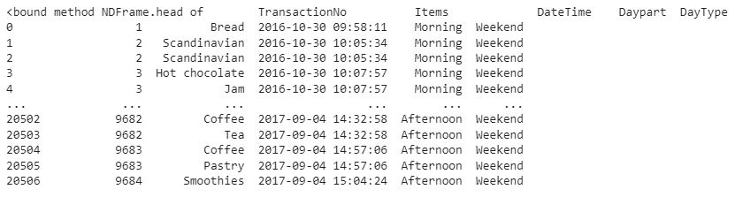
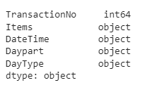
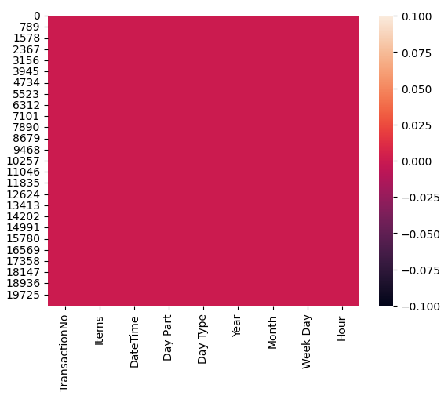
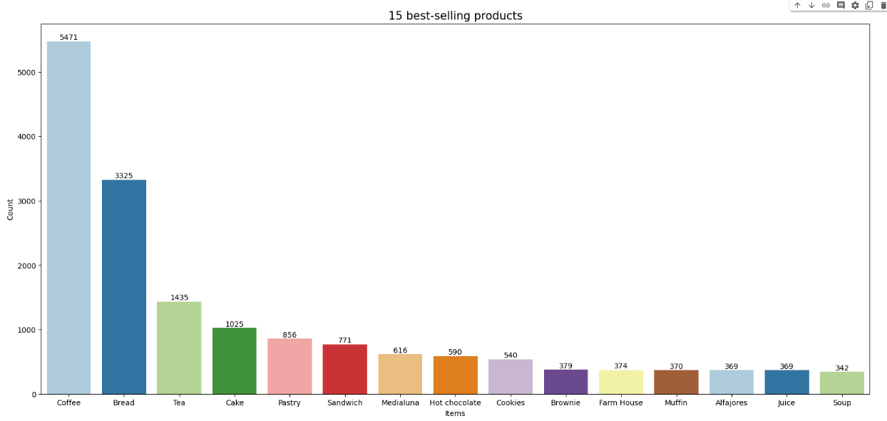
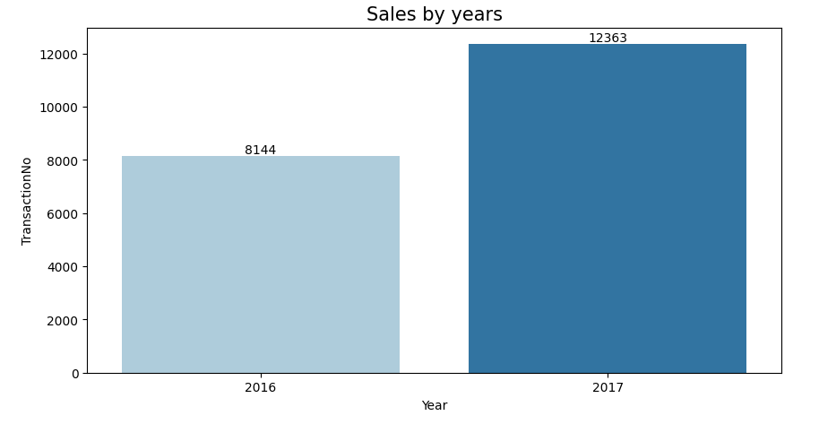
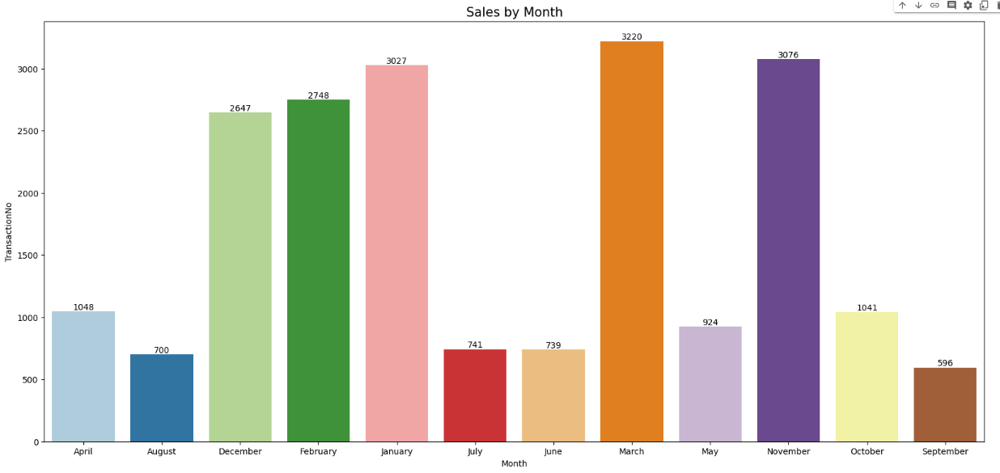
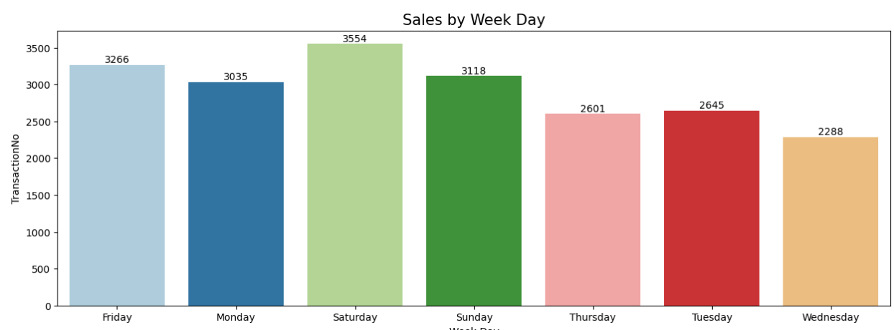
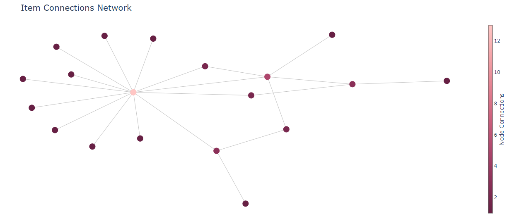

# Laporan Proyek Machine Learning
### Nama : Ilham Septa Nugraha
### Nim : 211351064
### Kelas : IF Pagi B

## Domain Proyek

Proyek ini berkaitan dengan prediksi cocok atau tidaknya kita makan ini lalu dipadukan dengan makanan atau minuman lain.

## Business Understanding

Dalam bagian ini dapat memberikan wawasan kepada orang yang hendak memakan sesuatu seperti kue atau cemilan ringan lainnya.
### Problem Statements

Latar belakang masalah :
- Pengguna kesulitan memikirkan kombinasi makanan atau minuman apa yang cocok untuk mendampingi makanannya.

### Goals

Tujuan dari pernyataan masalah:
- Agar pengguna bisa menentukan makanan apa yang cocok untuk mendampingi makanan atau minumannya.

## Data Understanding
Dataset diambil dari kaggle.<br> 

[Bakery Sales Dataset](https://www.kaggle.com/datasets/akashdeepkuila/bakery/code)

## Import Dataset

``` python
from google.colab import files
files.upload()
```
```python
!mkdir ~p ~/.kaggle
!cp kaggle.json ~/.kaggle/
!chmod 600 ~/.kaggle/kaggle.json
!ls ~/.kaggle
```
```python
!kaggle datasets download -d akashdeepkuila/bakery
```
```python
!mkdir bakery
!unzip bakery.zip -d bakery
!ls bakery
```

## Import Library
```python
import pandas as pd
import seaborn as sns
import matplotlib.pyplot as plt
from mlxtend.frequent_patterns import association_rules, apriori
import networkx as nx
import plotly.graph_objects as go
from plotly.offline import download_plotlyjs, init_notebook_mode, iplot
```

## Data Discovery
```python
df = pd.read_csv('bakery/Bakery.csv')
```

```python
df.head
```
<br>

```python
df.dtypes
```
<br>
Variabel-variabel pada Bakery Sales Dataset adalah sebagai berikut:<br>
- TransactionNo : Pengidentifikasi unik untuk setiap transaksi.<br>
- Items : Item dibeli.<br>
- DateTime : Stempel tanggal dan waktu transaksi.
- Daypart : Bagian hari saat transaksi dilakukan (pagi, siang, sore, malam).<br>
- DayType : Mengklasifikasikan apakah suatu transaksi telah dilakukan pada akhir pekan atau hari kerja.

## Data Preprocessing

```python
df.rename(columns={"DataTime":"Date Time","Daypart":"Day Part","DayType":"Day Type"},inplace=True)
```

```python
df["Year"]=pd.to_datetime(df["DateTime"]).dt.year
df["Month"]=pd.to_datetime(df["DateTime"]).dt.month
df["Week Day"]=pd.to_datetime(df["DateTime"]).dt.weekday
df["Hour"]=pd.to_datetime(df["DateTime"]).dt.hour
```

```python
### Replacing the names of the "Months"
df["Month"]=df["Month"].replace((1,2,3,4,5,6,7,8,9,10,11,12),('January','February' ,'March' ,'April' ,'May' ,'June' ,'July' ,'August' ,'September','October' ,'November' ,'December' ))
#### Replacing the names of the "Week Day"
df["Week Day"]=df["Week Day"].replace((0,1,2,3,4,5,6),('Monday','Tuesday' ,'Wednesday' ,'Thursday','Friday' ,'Saturday' ,'Sunday'))
### Changing hours
df["Hour"]=df["Hour"].replace((1, 7, 8, 9, 10, 11, 12, 13, 14, 15, 16, 17, 18, 19, 20, 21, 22, 23),('1-2','7-8','8-9','9-10','10-11','11-12','12-13','13-14','14-15','15-16','16-17','17-18','18-19','19-20','20-21','21-22','22-23','23-24'))
```

## EDA
```python
sns.heatmap(df.isnull())
plt.show()
```
<br>

```python
products=df["Items"].value_counts().head(15).reset_index(name="Count")
products=products.rename(columns={"index":"Items"})
plt.figure(figsize=(20,9))
colors=sns.color_palette("Paired")
ax=sns.barplot(x="Items",y="Count",data=products,palette=colors)
for i in ax.containers:
    ax.bar_label(i)
    plt.title("15 best-selling products",size=15)
```
<br>

```python
plt.figure(figsize=(10,5))
ax=sns.barplot(x="Year",y="TransactionNo",data=datayears,palette=colors)
for i in ax.containers:
    ax.bar_label(i)
    plt.title("Sales by years",size=15)
```
<br>

```python
plt.figure(figsize=(20,9))
colors=sns.color_palette("Paired")
ax=sns.barplot(x="Month",y="TransactionNo",data=datamonth,palette=colors)
for i in ax.containers:
    ax.bar_label(i)
    plt.title("Sales by Month",size=15)
```
<br>

```python
plt.figure(figsize=(15,5))
colors=sns.color_palette("Paired")
ax=sns.barplot(x="Week Day",y="TransactionNo",data=dataweek,palette=colors)
for i in ax.containers:
    ax.bar_label(i)
    plt.title("Sales by Week Day",size=15)
```
<br>

## Modelling
```python
dataapriori=df.groupby(["TransactionNo","Items"])["Items"].count().reset_index(name="Quantity")
```

```python
datapivot=dataapriori.pivot_table(index="TransactionNo",columns="Items",values="Quantity",aggfunc="sum").fillna(0)
```

```python
def table(x):
    if x<=0:
        return 0
    if x>=1:
        return 1

datapivottable=datapivot.applymap(table)
```

```python
aprioridata=apriori(datapivottable,min_support=0.01,use_colnames=True)
```

```python
rules=association_rules(aprioridata, metric = "lift", min_threshold = 1)
rules.sort_values("confidence",ascending=False).head(10)
```

## Visualisasi Hasil Algoritma
```python
network_A = list(rules["antecedents"].unique())
network_B = list(rules["consequents"].unique())
node_list = list(set(network_A + network_B))
G = nx.Graph()
for i in node_list:
    G.add_node(i)
for i,j in rules.iterrows():
    G.add_edges_from([(j["antecedents"], j["consequents"])])
pos = nx.spring_layout(G, k=0.5, dim=2, iterations=400)
for n, p in pos.items():
    G.nodes[n]['pos'] = p

edge_trace = go.Scatter(x=[], y=[], line=dict(width=0.5, color='#888'), hoverinfo='none', mode='lines')

for edge in G.edges():
    x0, y0 = G.nodes[edge[0]]['pos']
    x1, y1 = G.nodes[edge[1]]['pos']
    edge_trace['x'] += tuple([x0, x1, None])
    edge_trace['y'] += tuple([y0, y1, None])

node_trace = go.Scatter(x=[], y=[], text=[], mode='markers', hoverinfo='text',
    marker=dict(showscale=True, colorscale='Burg', reversescale=True, color=[], size=15,
    colorbar=dict(thickness=10, title='Node Connections', xanchor='left', titleside='right')))

for node in G.nodes():
    x, y = G.nodes[node]['pos']
    node_trace['x'] += tuple([x])
    node_trace['y'] += tuple([y])

for node, adjacencies in enumerate(G.adjacency()):
    node_trace['marker']['color']+=tuple([len(adjacencies[1])])
    node_info = str(adjacencies[0]) +'<br>No of Connections: {}'.format(str(len(adjacencies[1])))
    node_trace['text']+=tuple([node_info])

fig = go.Figure(data=[edge_trace, node_trace],
    layout=go.Layout(title='Item Connections Network', titlefont=dict(size=20),
    plot_bgcolor='white', showlegend=False, margin=dict(b=0,l=0,r=0,t=50),
    xaxis=dict(showgrid=False, zeroline=False, showticklabels=False),
    yaxis=dict(showgrid=False, zeroline=False, showticklabels=False)))

iplot(fig)
```
<br>

## Deployment
## [Link Aplikasi Streamlit](https://market-bakery.streamlit.app/)

